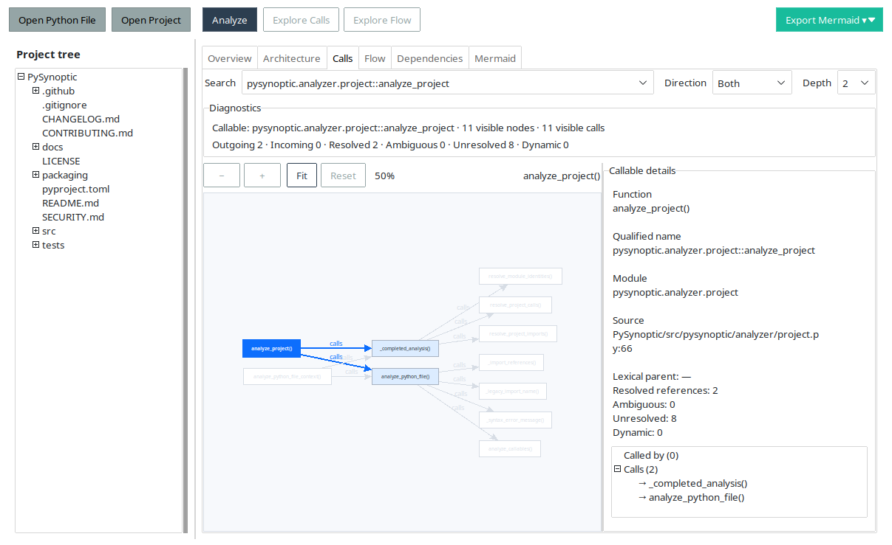
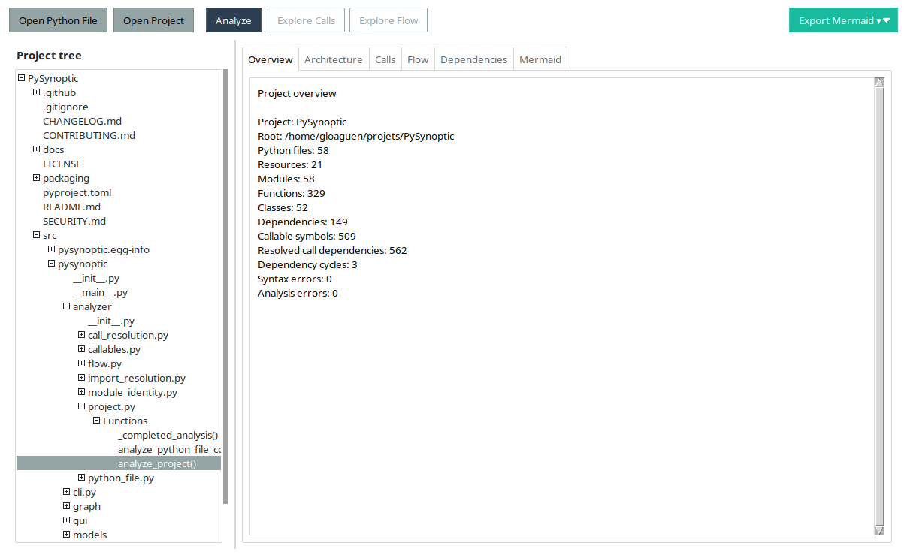
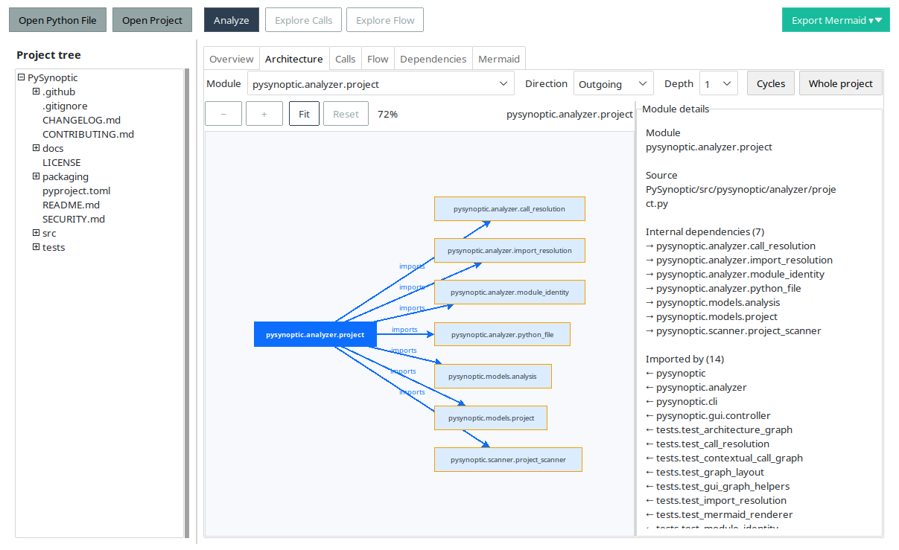
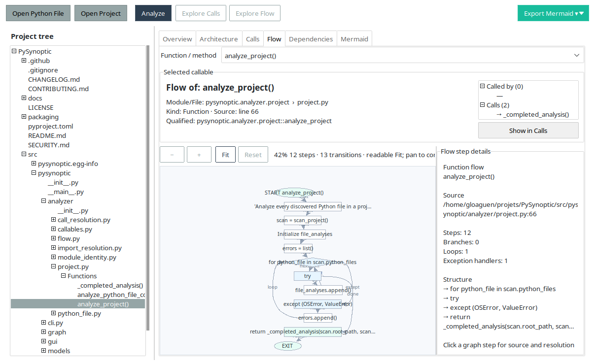
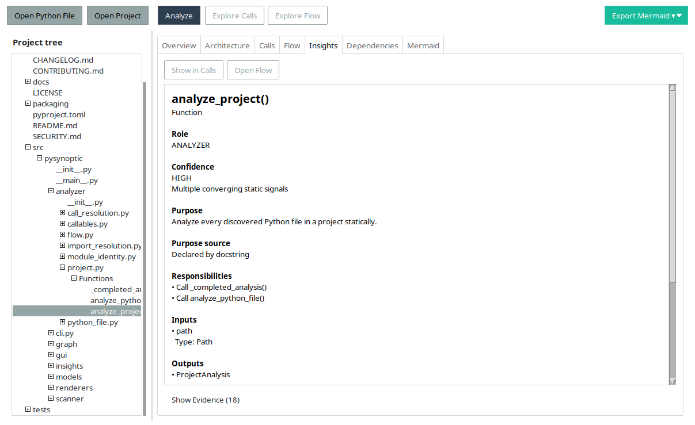
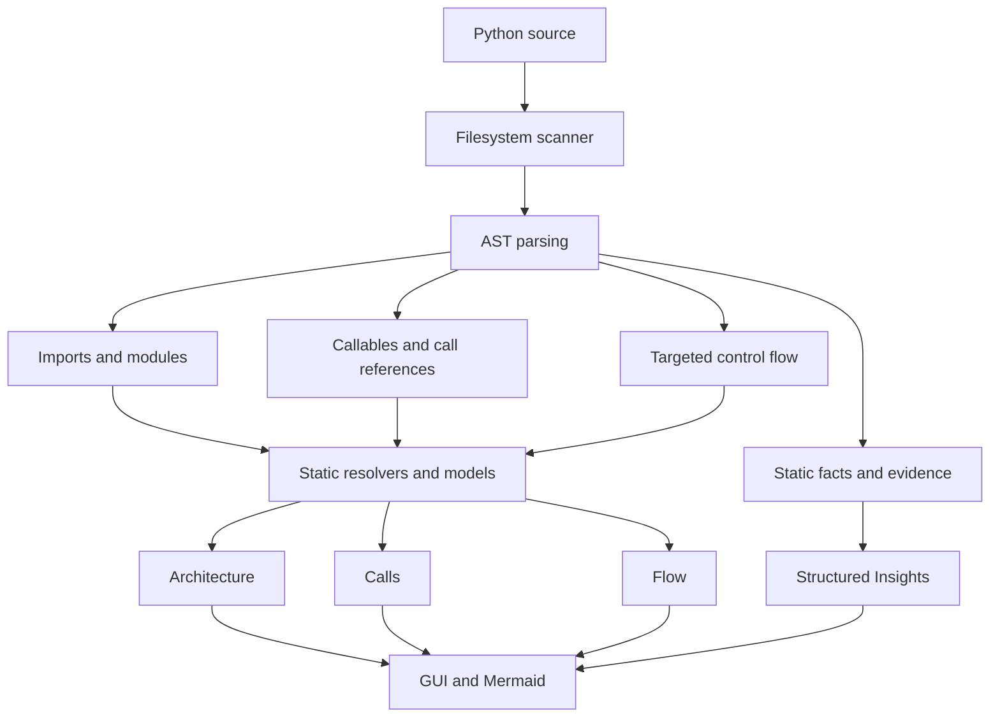

# PySynoptic

Understand Python architecture, calls, control flow, and the statically
observable purpose of code without executing the analyzed project.

[](https://github.com/tonygloaguen/PySynoptic/actions/workflows/ci.yml)
[](https://www.python.org/)
[](LICENSE)



## What is PySynoptic?

PySynoptic is an open-source static Python code explorer for a single `.py`
file or an entire project. Its focused desktop views connect three levels of
understanding:

- **Architecture** — dependencies between modules;
- **Calls** — callable relationships supported by strong static evidence;
- **Flow** — control structure inside one function or method;
- **Insights** — deterministic explanations of modules, classes, functions,
  and methods, with evidence and qualitative confidence.

The result is a navigable synopsis of an unfamiliar codebase, from its package
shape down to branches, loops, exception handlers, and returns.

## Why PySynoptic?

Understanding unfamiliar Python often means manually following imports across
modules, locating declarations, tracing calls, and then reading each condition,
loop, and exception path. Large all-at-once diagrams are rarely better.

PySynoptic turns the same static information into bounded, interactive views.
Choose a module or callable, select a direction and depth, and expand the part
of the program that matters now.

## Key features

- single-file and recursive project analysis;
- stable module identity and internal dependency resolution;
- interactive, focused Architecture view with cycle discovery;
- callable inventory and conservative static call resolution;
- bounded Calls graphs with incoming, outgoing, and bidirectional exploration;
- per-callable Flow graphs for branches, loops, exceptions, calls, and exits;
- deterministic Static Insights for code roles, purposes, inputs, outputs,
  side effects, and supporting evidence;
- deterministic **How it works** explanations with hierarchical Key Steps and
  direct navigation to highlighted Flow nodes;
- optional AI-enhanced reformulation through OpenAI-compatible or
  Ollama-compatible providers;
- short graph labels backed by detailed source and relationship panels;
- pan, zoom, fit, focus navigation, and contextual Mermaid export;
- asynchronous analysis that keeps the desktop interface responsive;
- deterministic AST/model output suitable for tests and version control;
- standalone Windows x64 and Linux x64 packaging;
- a deliberate static-analysis-only security boundary.

## Screenshots

All screenshots below are from the current PySynoptic application analyzing its
own source tree.

### Overview



The Overview summarizes files, modules, declarations, dependencies, resolved
call relationships, cycles, and analysis diagnostics before deeper
exploration.

### Architecture



An Architecture arrow means **importing module → imported module**. Focus on a
module and inspect its outgoing dependencies, incoming importers, declarations,
source path, and cycle membership. Direction and depth controls keep the view
bounded; cycle-only and whole-project views remain available explicitly.

### Calls


A Calls arrow means **caller → callee**. Search for a module or callable, then
explore Incoming, Outgoing, or Both at depth 1, 2, or 3. Only conservatively
resolved relationships become graph edges; unresolved, ambiguous, and dynamic
references remain visible as diagnostics rather than speculative links.

### Flow



Flow explains the structure inside one callable. It represents `if`/`else`,
`for`/`while`, `try`/`except`/`finally`, `break`, `continue`, `raise`, `return`,
and call steps. Labeled transitions distinguish branches, loop backs, exception
paths, and exits. This view of `analyze_project()` connects its selected tree
entry and call context to the loop and exception path inside the function.

### Insights



Insights provides deterministic static explanations for modules, classes,
functions, and methods. Each card leads with a concise **Role**, **Purpose**,
and qualitative **Confidence**, then exposes responsibilities, inputs, outputs,
side effects, callers/callees, and the static **Evidence** behind the result.
Evidence stays collapsed by default so the explanation remains readable.

## Standalone Python files

PySynoptic is not limited to package trees. Open one `.py` file to see its
functions, classes, methods, imports, call references, conservatively resolved
local callable relationships, focused Calls view, and per-function Flow. A
single-module Architecture view states that there is only one module rather
than presenting an empty graph.

## How it works



The scanner inventories files and resources. Python source is read as text and
parsed with `ast.parse()`. Analyzer layers interpret syntax into immutable
models; graph builders and renderers consume those models. **Source from the
analyzed project is never imported or executed.**

## Static Insights

Static Insights answers two complementary questions from locally derived AST
facts and the existing static models:

- **What is it for?** — **Role** and **Purpose** describe the statically
  observable intent of a module, class, function, or method.
- **How does it work?** — **How it works** and hierarchical **Key Steps**
  summarize a callable's decisions, loops, exception paths, calls, and
  outcomes. Selecting a Key Step opens Flow and highlights the corresponding
  node.

The explanation also reports:

- **Role** — a conservative category such as analyzer, parser, renderer, or
  orchestrator;
- **Purpose** — either author-declared information from a docstring or a
  clearly identified static inference;
- **Confidence** — evidence quality, never a probability;
- **Inputs / Outputs / Side effects** — statically observable interface and
  operations;
- **Evidence** — the exact signals that support the explanation.

Confidence levels mean:

- **HIGH** — multiple converging static signals;
- **MEDIUM** — useful static evidence with limitations;
- **UNKNOWN** — insufficient evidence for a reliable role.

PySynoptic prefers **Unknown** over a convincing but unsupported explanation.
Static Insights and FlowExplanation do not require AI or an external service
and remain deterministic for the same source and version. Their CFG and
explanation results are computed lazily and cached for responsive navigation.
Docstrings are identified as author-declared information; inferred purposes
are presented separately. Insights are conservative explanations, not a claim
that every inferred role or purpose is always correct.

## Optional AI explanations

AI explanations are an optional reformulation layer for **How it works**. They
are disabled by default and run only after an explicit user action. PySynoptic
supports OpenAI-compatible and Ollama-compatible endpoints; it asks for
confirmation before sending data to a remote endpoint.

The raw Python source is never sent. The provider receives a bounded structured
representation derived from the static analysis, with quoted literals
redacted. Names, symbols, and inferred purposes remain present and may still be
sensitive. Provider settings and API keys are session-only (or read from the
environment), requests are limited to 12,000 characters, and returned prose is
limited to 2,000 characters. Network work runs outside the Tk thread.

AI text is a readability aid only. It never becomes Evidence and never replaces
the deterministic static explanation as PySynoptic's source of truth.

## Static analysis philosophy

Python permits runtime behavior that source alone cannot always prove.
PySynoptic therefore classifies every call reference explicitly:

- **Resolved** — strong static evidence identifies exactly one target.
- **Ambiguous** — more than one statically valid target remains.
- **Unresolved** — the syntax is understood, but available evidence is
  insufficient or a name is shadowed.
- **Dynamic** — runtime computation prevents reliable static resolution.

PySynoptic prefers an unresolved result over a speculative false positive.
Resolution covers cases such as lexical functions, explicit imports and aliases,
and same-class `self.method()` or `cls.method()` calls. It does not claim a
complete Python call graph.

## Security model

Analyzed code is **never**:

- imported or loaded as a package;
- executed directly;
- evaluated with `eval` or `exec`;
- launched through a subprocess;
- inspected through runtime module loading or introspection.

Analysis, including deterministic Insights and FlowExplanation, uses filesystem
metadata, source text, Python's AST, and static models locally. Optional AI
explanations never transmit raw Python source, but their structured request can
contain names, symbols, and purposes; remote transmission requires explicit
configuration, action, and confirmation. See [SECURITY.md](SECURITY.md) for the
complete boundary, privacy details, vulnerability reporting, and the
supported-release policy.

## Installation

### Standalone application

The `v0.3.0` release provides native, self-contained assets built separately for
each platform:

- `PySynoptic-v0.3.0-Windows-x64.zip`
- `PySynoptic-v0.3.0-Linux-x64.tar.gz`

Download an archive from [GitHub Releases](https://github.com/tonygloaguen/PySynoptic/releases).

On Windows, extract the complete ZIP and launch `PySynoptic.exe`. Keep the
`_internal` directory beside the executable. Windows SmartScreen may display a
warning because the first public release is not code-signed; this does not mean
the application failed to start.

On Linux, extract the archive and run the `PySynoptic` executable inside the
directory. A graphical desktop is required. The bundle is built natively and
does not require a separate Python installation.

### From source

Python 3.11 or newer is required.

```bash
git clone https://github.com/tonygloaguen/PySynoptic.git
cd PySynoptic
python -m venv .venv
```

Activate the environment:

```bash
# Linux
source .venv/bin/activate

# Windows PowerShell
.venv\Scripts\Activate.ps1
```

Install and launch:

```bash
python -m pip install --upgrade pip
python -m pip install -e .
pysynoptic-gui
```

For development tools:

```bash
python -m pip install -e ".[dev]"
```

## Using the desktop application

1. Select **Open Python File** or **Open Project**.
2. Select **Analyze**.
3. Read the project or file summary in **Overview**.
4. Explore module imports in **Architecture**.
5. Search for callable relationships in **Calls**.
6. Open one function or method in **Flow**.
7. Read its role, purpose, confidence, interface, side effects, and evidence in
   **Insights**.
8. Export the current Architecture, Calls, or Flow view as Mermaid.

Architecture and Calls support focused exploration with **Incoming**,
**Outgoing**, or **Both** and a depth of 1, 2, or 3. Double-clicking a graph node
makes it the new focus. Graph nodes keep labels short; the side panel provides
qualified names, paths, line numbers, diagnostics, callers, and callees.

Launch the source installation with:

```bash
pysynoptic-gui
# or
python -m pysynoptic.gui
```

## CLI

Analyze a single file:

```bash
pysynoptic path/to/module.py
```

Analyze a project directory:

```bash
pysynoptic path/to/project/
```

Generate Mermaid for a project, either on standard output or in a file:

```bash
pysynoptic path/to/project/ --format mermaid
pysynoptic path/to/project/ --format mermaid --output dependencies.mmd
```

Text output can also be written with `--output`. Mermaid CLI export currently
requires a project directory; contextual Architecture, Calls, and Flow exports
are available from the desktop application.

The analysis API can be used independently of the CLI:

```python
from pathlib import Path

from pysynoptic import analyze_project, analyze_python_file, render_mermaid

file_analysis = analyze_python_file(Path("path/to/module.py"))
project_analysis = analyze_project(Path("path/to/project"))
mermaid = render_mermaid(project_analysis)
```

## Current limitations

- Python is dynamic, so not every call can be resolved statically.
- Generic `obj.method()` calls usually require runtime or type information.
- Inheritance, receiver-type inference, runtime tracing, debugging, and
  profiling are outside the current scope.
- Flow graphs are structural explanations rather than compiler-perfect CFGs.
- Exception flow is syntactic and conservative; it does not prove which
  statement raises.
- Unresolved and dynamic calls are not shown as proven graph edges.
- Very large global graphs can still be dense; focused views are the primary
  navigation model.
- Mermaid is exported as source text without an embedded preview.
- Windows bundles are not code-signed.
- Linux bundle compatibility depends on the build environment and compatible
  `glibc`.
- No macOS bundle is available yet.
- Static Insights can remain Unknown when the available source does not provide
  enough reliable evidence, and inferred purposes are not guaranteed to match
  every author's intent.
- AI-enhanced explanations require a separately configured compatible service;
  their prose may be incomplete or inaccurate and is never treated as static
  Evidence.

These are deliberate scope boundaries, not claims of complete Python runtime
analysis or infallible code understanding.

## Contributing and project documents

- [Contributing guide](CONTRIBUTING.md)
- [Changelog](CHANGELOG.md)
- [Security policy](SECURITY.md)
- [Generated dependency diagram](docs/pysynoptic-dependencies.mmd)

Contributions must preserve the static-analysis boundary: analyzed project code
must never be imported or executed.

## License

PySynoptic is released under the [MIT License](LICENSE).
